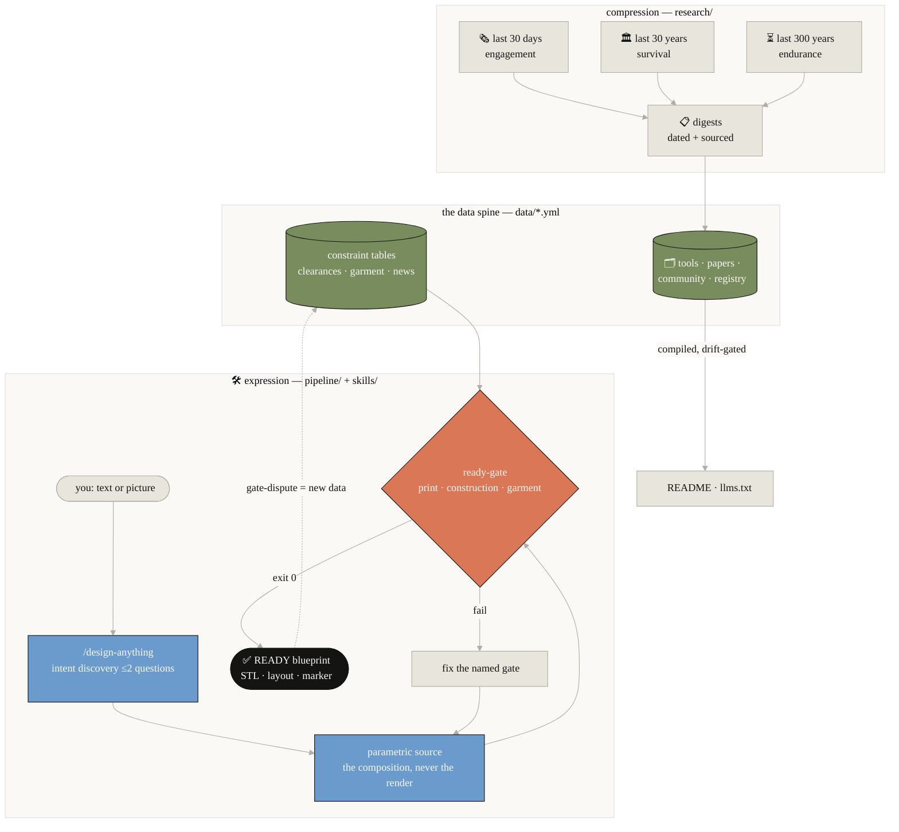
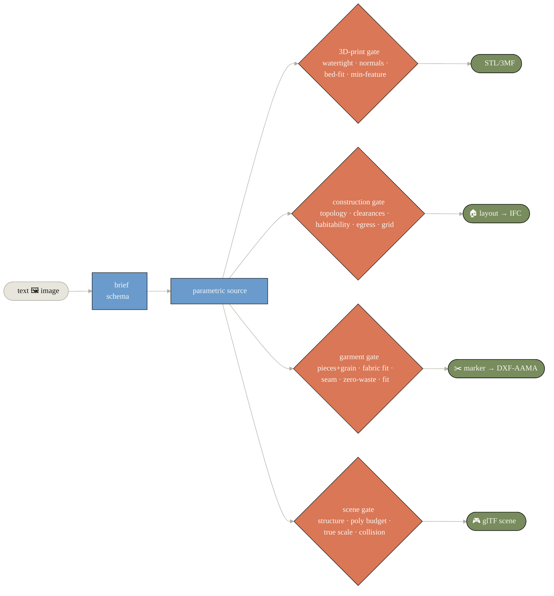
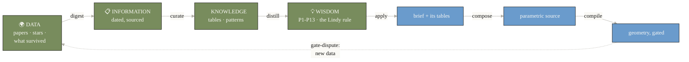
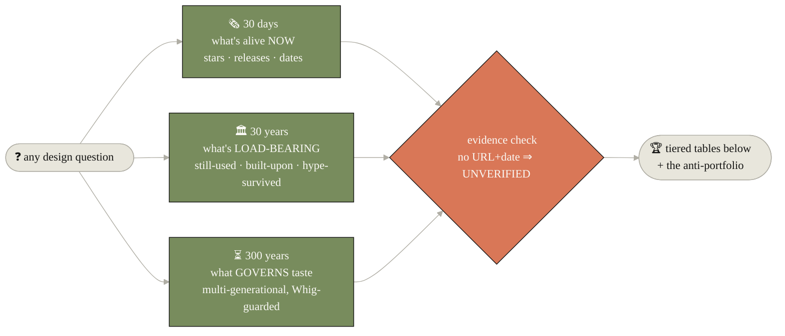
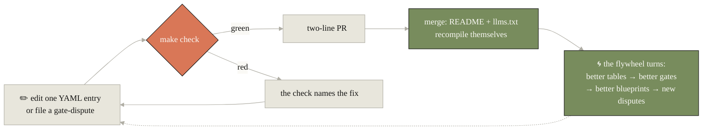

# design-anything

**Any design intent in (text, picture) → execution-ready 3D blueprint out — construction- and 3D-print-verified.**

Covering: game design · 3D simulation · residential & commercial architecture (3D printing + AI) · interior design (furniture, kitchen, bedroom, living room, balcony) · garden & landscape · garment & cloth design. The full map of design-centric disciplines (and what qualifies one for this repo): [docs/DESIGN_DISCIPLINES.md](docs/DESIGN_DISCIPLINES.md).

Sibling of [animate-anything](https://github.com/wjlgatech/animate-anything) and [FM-os](https://github.com/wjlgatech/FM-os) — same operating system, new domain.

## 📰 News

Significant updates, newest first (curated in [`data/news.yml`](data/news.yml), drift-gated like everything else).

<!-- BEGIN:news -->

- **2026-07-19** — [v0.13.0 — dogfood-born golden #6 + the GarmentCode emitter (M12b)](https://github.com/wjlgatech/design-anything/releases/tag/v0.13.0) — The first live /design-anything run (a hex pen holder brief) passed all four print gates first try and got banked as a golden example per the reflect protocol. Markers now export as GarmentCode specifications — round-trip verified, with the honest finding that the PyPI wheel lacks the pattern subpackage (deep validation needs the repo checkout, reported when skipped).
- **2026-07-19** — [v0.12.0 — the flagship learns every satellite, automatically](https://github.com/wjlgatech/design-anything/releases/tag/v0.12.0) — /design-anything now carries a satellite-routing table GENERATED from data/satellites.yml under the same drift gate — backbone keeps only the durable rules (load the matched one, STALE means re-verify, external code stays untrusted, our gates judge). Adding a satellite updates the flagship without editing it; CI asserts reachability.
- **2026-07-19** — [v0.11.0 — satellites: knowledge + tooling compiled from every top-cited repo](https://github.com/wjlgatech/design-anything/releases/tag/v0.11.0) — Five gold-tier cited repos (TRELLIS.2, blender-mcp, SpatialLM, Seamly2D, GarmentCode) each get a SHA-pinned deep digest and a generated skill — compiled by satellites.py, drift-gated, never vendored. Staleness is measured weekly by a freshness workflow, not promised. Digest finds include SpatialLM's non-commercial encoder weights and Seamly2D's unimplemented ASTM export.
- **2026-07-19** — [v0.10.0 — IFC export, the eyewear body-fit domain, and the knowledge map](https://github.com/wjlgatech/design-anything/releases/tag/v0.10.0) — Three milestones in one train — construction layouts export as IFC4 (round-trip verified, ifcopenshell optional and honest about absence); eyewear lands as the first body-fit domain (tables + gate + a golden fit-spec AND printable temple); and the whole data spine compiles into an interactive knowledge map on GitHub Pages, drift-gated like everything else.
- **2026-07-19** — [v0.9.0 — production-real garments: DXF-AAMA, size grading, seam pairs](https://github.com/wjlgatech/design-anything/releases/tag/v0.9.0) — The apron grades S/M/L with every size gated independently; symmetric pieces must match through grading (F6); and markers export as the AAMA subset every pattern CAD imports — verified by round-trip, never by claim. GarmentCode emission honestly deferred pending an upstream verification path.
- **2026-07-18** — [v0.8.0 — the scene gate: every route in the pipeline is now verifiable](https://github.com/wjlgatech/design-anything/releases/tag/v0.8.0) — The last roadmap gate ships — glTF structure, poly budget vs target platform, true-scale-in-meters (the units-bug catcher), collision presence. Golden courtyard arena passes; 7 known-bad mutations fail by test. The Gate seam from v0.7.0 made it a subclass, not a rebuild.
- **2026-07-18** — [v0.7.0 — the Gate seam + the repo audits itself](https://github.com/wjlgatech/design-anything/releases/tag/v0.7.0) — OOP refactor 50→83 around a shared Gate base class (a new domain gate becomes a subclass, not a rebuild); the AI-native self-audit lands in CI — 12 operating principles with in-repo evidence, so a regression in HOW the repo operates fails the build.
- **2026-07-18** — [v0.6.0 — the README learns to draw (and to report the news)](https://github.com/wjlgatech/design-anything/releases/tag/v0.6.0) — Architecture system-design diagram plus a brand-themed Mermaid on every major section, all CI-checked; this news section itself ships as spec-as-data under the drift gate.
- **2026-07-18** — [v0.5.0 — eval scenarios: the skill gets its own gate](https://github.com/wjlgatech/design-anything/releases/tag/v0.5.0) — 10 skill-creator-format scenarios covering every gated route plus should-NOT-trigger cases; CI proves the broken-STL fixture genuinely fails its gate, so the eval can't be fake. Closes Anthropic's pre-share checklist.
- **2026-07-18** — [v0.4.0 — /design-anything: the engine gets a front door](https://github.com/wjlgatech/design-anything/releases/tag/v0.4.0) — A Claude Code slash-skill built to Anthropic's authoring guidance — a thin router that discovers design intent (≤2 questions), routes to the matching gate, and cannot drift from the engine (every referenced path is CI-asserted). Self-aware/heal/improve defined as protocols, not adjectives.
- **2026-07-18** — [v0.3.0 — garment design + the DIKW organizing model](https://github.com/wjlgatech/design-anything/releases/tag/v0.3.0) — 7th domain with pattern gate v0.1 (zero-waste marker efficiency as a number); DIKW compression↔expression becomes the stated organizing model; the design-disciplines map lands with the inclusion rule. RTFKT joins the anti-portfolio at −99.8%.
- **2026-07-18** — [v0.2.0 — the construction ready-gate](https://github.com/wjlgatech/design-anything/releases/tag/v0.2.0) — Floor plans validated against Neufert/IRC/ADA-lineage clearance tables as data — topology, clearances, habitability, egress, module grid. Golden 28.5 m² studio flat passes; 7 known-bad mutations fail by test. Gate-dispute issue template ships ("a false READY is a bug in the definition of ready").
- **2026-07-18** — [v0.1.0 — launch: ready is a gate, not a vibe](https://github.com/wjlgatech/design-anything/releases/tag/v0.1.0) — Public launch with the 3D-print ready gate, three-window research digests (30 days / 30 years / 300 years), 13 survival-tested principles, spec-as-data with a CI drift gate, and the finding that set the roadmap — meshes are solved, blueprints are not.
<!-- END:news -->

## Architecture — the system design

Two coupled loops around one data spine: research **compresses** the world into
tables and principles; the pipeline **expresses** them back as gated artifacts.
Nothing reaches the user unverified, and every verified failure feeds the spine.



`make check` is the finish line CI runs over all of it: schema validation + the full test suite + the README/llms.txt drift gate + all three golden slices re-gated.

## Why this repo is different

1. **"Ready" is a gate, not a vibe.** No output may claim print/construction-ready without passing machine checks ([`pipeline/ready_gate.py`](pipeline/ready_gate.py)). No evidence ⇒ Not ready.
2. **Three-window research.** Everything curated here is ranked by observed evidence in three time windows — [last 30 days](research/last30days/DIGEST.md) (engagement), [last 30 years](research/last30years/DIGEST.md) (survival), [last 300 years](research/last300years/DIGEST.md) (civilizational endurance) — never by hype.
3. **Spec-as-data.** Curated knowledge lives in [`data/*.yml`](data/); the tables below are compiled artifacts with a CI drift gate. Humans edit YAML, never generated tables.
4. **Emit the composition, not the render.** Blueprints are deterministic parametric *source* (reviewable, diffable, re-generatable), never opaque meshes.

## The pipeline



**Try the vertical slices:**

```bash
# print target (stdlib-only): text brief → parametric solid → STL → gate
python3 examples/planter/generate.py planter.stl
python3 pipeline/ready_gate.py planter.stl --min-feature 3.0

# construction target: text brief → parametric floor plan → layout JSON → gate
python3 examples/studio-flat/generate.py layout.json
python3 pipeline/construction_gate.py layout.json

# garment target: text brief → parametric pattern → marker JSON → gate
python3 examples/apron/generate.py marker.json
python3 pipeline/pattern_gate.py marker.json

make check   # the whole finish line CI runs
```

Agents: a flat, token-cheap index of everything curated here is compiled to [`llms.txt`](llms.txt). Humans: the same spine renders as an [interactive knowledge map](https://wjlgatech.github.io/design-anything/map.html) (compiled + drift-gated, like everything else).

## Design principles



The distilled, survival-tested rules — each traceable to its research window — live in [`principles/DESIGN_PRINCIPLES.md`](principles/DESIGN_PRINCIPLES.md). The organizing mental model — **DIKW compression ↔ expression** (research compresses the world into principles; the pipeline expresses principles into gated artifacts) — is [`principles/DIKW_MODEL.md`](principles/DIKW_MODEL.md). Design thinking, honestly tiered (keep the kernel, drop the theater): [`principles/DESIGN_THINKING.md`](principles/DESIGN_THINKING.md). Best practices: [`best-practices/BEST_PRACTICES.md`](best-practices/BEST_PRACTICES.md). The 10X goal contract that governs the roadmap: [`GOAL.md`](GOAL.md).

## AI tooling — skills, bundles, workflows

Skills are packaged agent capabilities (one folder, one `SKILL.md`, eval-with-teeth). Bundles compose them; workflows orchestrate them dynamically. See [`skills/`](skills/), [`bundles/`](bundles/), [`workflows/`](workflows/).

```mermaid
%%{init: {'theme':'base','themeVariables':{'primaryColor':'#e8e6dc','primaryTextColor':'#141413','primaryBorderColor':'#b0aea5','lineColor':'#b0aea5','secondaryColor':'#faf9f5','tertiaryColor':'#faf9f5','fontFamily':'Poppins, ui-sans-serif, system-ui, -apple-system, Arial, sans-serif'}}}%%
flowchart LR
    classDef anthroOrange fill:#d97757,color:#faf9f5,stroke:#141413;
    classDef anthroBlue fill:#6a9bcc,color:#faf9f5,stroke:#141413;
    U([🙋 "design me a…"<br/>no toolset knowledge needed]) --> FA[🧭 /design-anything<br/>absorb → route<br/>≤2 questions, visible defaults]
    FA -->|photo?| S1[📷 scene-to-layout]
    FA -->|open brief?| S2[📚 pattern-library] --> S3[🧾 brief-to-blueprint]
    FA -->|tool question?| S4[🔬 design-research]
    S1 & S3 --> CHK[🚦 the matching<br/>*-ready-check skill]
    CHK -->|exit 0 only| R([✅ verified answer])
    class FA anthroBlue
    class CHK anthroOrange
```

**The flagship is `/design-anything`** — a thin router over this engine that discovers your design intent (no toolset knowledge needed), routes to the matching domain + gate, and drives compose→gate→reflect. Install into Claude Code with one symlink (updates then flow with `git pull`):

```bash
ln -sfn "$(pwd)/skills/design-anything" ~/.claude/skills/design-anything
```

Design rationale — what's backbone vs progressively disclosed, and how self-aware/self-heal/self-improve are made testable: [`docs/SKILL_DESIGN.md`](docs/SKILL_DESIGN.md).

<!-- BEGIN:skills -->

| Skill | Status | What it does |
|---|---|---|
| [design-anything](https://github.com/wjlgatech/design-anything/tree/main/skills/design-anything) | dogfooded | The flagship slash-skill — discovers any design intent, routes to the matching domain and gate, drives compose-gate-reflect; a thin router over this engine, CI-tested against drift. |
| [brief-to-blueprint](https://github.com/wjlgatech/design-anything/tree/main/skills/brief-to-blueprint) | dogfooded | Compile a text/image design brief into a parametric blueprint plan with explicit constraints and a target ready-gate. |
| [print-ready-check](https://github.com/wjlgatech/design-anything/tree/main/skills/print-ready-check) | dogfooded | Run the ready gate on an STL and report READY/NOT-READY with per-gate evidence. |
| [construction-ready-check](https://github.com/wjlgatech/design-anything/tree/main/skills/construction-ready-check) | dogfooded | Run the construction ready gate on a rooms+openings layout — clearances, habitability, daylight, egress, module grid. |
| [garment-ready-check](https://github.com/wjlgatech/design-anything/tree/main/skills/garment-ready-check) | dogfooded | Run the pattern gate on a garment marker — pieces, grain, fabric fit, seam allowance, zero-waste efficiency, fit tables. |
| [scene-ready-check](https://github.com/wjlgatech/design-anything/tree/main/skills/scene-ready-check) | dogfooded | Run the scene gate on a glTF — structure, poly budget vs target platform, true scale in meters, collision present. |
| [bodyfit-ready-check](https://github.com/wjlgatech/design-anything/tree/main/skills/bodyfit-ready-check) | dogfooded | Run the body-fit gate on a fit spec — completeness, anthropometric/ISO ranges, frame-PD alignment, print floor; eyewear first. |
| [blueprint-validate](https://github.com/wjlgatech/design-anything/tree/main/skills/blueprint-validate) | dogfooded | Validate a blueprint against the enduring-principles checklist (anthropometrics, modular grid, daylight, layers). |
| [pattern-library](https://github.com/wjlgatech/design-anything/tree/main/skills/pattern-library) | dogfooded | Retrieve applicable Alexander-style patterns (context/problem/solution) for a brief before generating form. |
| [scene-to-layout](https://github.com/wjlgatech/design-anything/tree/main/skills/scene-to-layout) | dogfooded | Turn a room photo/scan into a structured layout (walls, openings, furniture) using SpatialLM-class tools. |
| [design-research](https://github.com/wjlgatech/design-anything/tree/main/skills/design-research) | dogfooded | Run the three-window research method (30 days/30 years/300 years) on any design question, with grounding rules. |
<!-- END:skills -->

## 🛰️ Satellites — knowledge + tooling from every top-cited repo

Each gold-tier cited repo gets a **satellite**: a SHA-pinned deep digest (`KNOWLEDGE.md`) + a generated skill — compiled by [`scripts/satellites.py`](scripts/satellites.py), never hand-written, never vendored. Staleness is measured weekly, not promised. Design rationale: [docs/SATELLITES.md](docs/SATELLITES.md).

<!-- BEGIN:satellites -->

| Satellite | Upstream | Stars | Digest | Status |
|---|---|---|---|---|
| [use-trellis-2](skills/use-trellis-2/SKILL.md) | [microsoft/TRELLIS.2](https://github.com/microsoft/TRELLIS.2) | 8,806 | [`75fbf0183001`](skills/use-trellis-2/KNOWLEDGE.md) | fresh |
| [use-blender-mcp](skills/use-blender-mcp/SKILL.md) | [ahujasid/blender-mcp](https://github.com/ahujasid/blender-mcp) | 24,489 | [`6641189231ca`](skills/use-blender-mcp/KNOWLEDGE.md) | STALE |
| [use-spatiallm](skills/use-spatiallm/SKILL.md) | [manycore-research/SpatialLM](https://github.com/manycore-research/SpatialLM) | 4,616 | [`8913c44d84a4`](skills/use-spatiallm/KNOWLEDGE.md) | fresh |
| [use-seamly2d](skills/use-seamly2d/SKILL.md) | [FashionFreedom/Seamly2D](https://github.com/FashionFreedom/Seamly2D) | 913 | [`dacc5600e29f`](skills/use-seamly2d/KNOWLEDGE.md) | fresh |
| [use-garmentcode](skills/use-garmentcode/SKILL.md) | [maria-korosteleva/GarmentCode](https://github.com/maria-korosteleva/GarmentCode) | 387 | [`d44962997902`](skills/use-garmentcode/KNOWLEDGE.md) | fresh |

*Facts fetched 2026-07-20 by the weekly freshness sync; STALE means upstream moved past the digest's pinned sha.*
<!-- END:satellites -->

## The landscape — curated tools

Ranked by observed evidence (recency, engagement, survival). Full method + dates in [`research/`](research/).



<!-- BEGIN:tools -->

### text/image-to-3D

| Tier | Tool | What it is |
|---|---|---|
| 🥇 | [Microsoft TRELLIS.2](https://github.com/microsoft/TRELLIS.2) | Open (MIT) 4B image-to-3D flow-matching model; any topology, full PBR, GLB/PLY/OBJ export. |
| 🥇 | [Zoo.dev Text-to-CAD (Zookeeper)](https://zoo.dev/research/zookeeper) | Conversational agent emitting true parametric CAD (STEP/DXF, dimensioned) — blueprints, not meshes; open-source, self-hostable. |
| 🥈 | [Meshy-6](https://www.meshy.ai/blog/meshy-6-launch) | Market-leader SaaS mesh pipeline with PBR texturing, auto-rig, engine plugins, and multi-color 3D-print export. |
| 🥉 | [Hunyuan3D-2](https://github.com/Tencent-Hunyuan/Hunyuan3D-2) | Fully open asset generator (weights + training code, PBR); momentum shifting to TRELLIS.2. |

### agent-infrastructure

| Tier | Tool | What it is |
|---|---|---|
| 🥇 | [blender-mcp](https://github.com/ahujasid/blender-mcp) | Drive Blender from any LLM via MCP — the natural execution backbone from agent to printable geometry. |

### interior-design

| Tier | Tool | What it is |
|---|---|---|
| 🥇 | [SpatialLM](https://github.com/manycore-research/SpatialLM) | LLM for structured indoor modeling — point cloud/scene to walls, doors, and furniture layout as structured output. |
| 🥈 | [Spacely AI](https://www.spacely.ai/) | Photoreal room renders with element-level masking, used by boutique studios. |
| 🥉 | [Planner 5D AI](https://planner5d.com/use/ai-interior-design) | CAD-lite 3D floor planner with an AI layout/style module. |

### architecture

| Tier | Tool | What it is |
|---|---|---|
| 🥇 | [Autodesk Forma (Building Layout Explorer)](https://adsknews.autodesk.com/en/news/building-layout-explorer-in-autodesk-forma/) | Generative interior-layout variants with solar/carbon analysis, pushing straight into Revit. |
| 🥈 | [Finch3D](https://parametric-architecture.com/finch-launches-forma-extension/) | AI floor-plan copilot; Forma extension unifying massing, space planning, and Revit BIM. |

### construction-3D-printing

| Tier | Tool | What it is |
|---|---|---|
| 🥈 | [ICON (Titan + Vitruvius)](https://www.iconbuild.com/newsroom/icon-unveils-new-construction-technologies-for-lowest-cost-fastest-and-most-sustainable-way-to-build-at-scale) | ~250 printed structures; multi-story robotic printing plus an AI architect aiming at permit-ready designs. |
| 🥇 | [COBOD](https://cobod.com/) | Best-selling construction printers in 35+ countries — the "arm the builder" survival pattern. |
| 🥉 | [WASP](https://www.3dwasp.com/) | Earth-material construction printing (TECLA habitat) — the sustainable branch that persisted. |

### game-and-simulation

| Tier | Tool | What it is |
|---|---|---|
| 🥇 | [Marble (World Labs)](https://www.worldlabs.ai/blog/marble-world-model) | Multimodal world model — text/image/video/layout to editable 3D worlds exporting splats, meshes, or video. |
| 🥇 | [NVIDIA Cosmos 3 + Isaac Lab 3.0](https://blogs.nvidia.com/blog/gtc-2026-virtual-worlds-physical-ai/) | First fully open "omnimodel" world foundation model plus robot-sim stack on the Newton physics engine. |
| 🥈 | [Project Genie (Genie 3)](https://blog.google/innovation-and-ai/models-and-research/google-deepmind/project-genie/) | Real-time navigable worlds from text — an ideation layer, not an engine replacement. |

### survivor-foundations

| Tier | Tool | What it is |
|---|---|---|
| 🥇 | [Blender](https://www.blender.org/) | The free 3D DCC that survived bankruptcy and won an Oscar — 30-year survivor, default research render tool. |
| 🥇 | [Rhino + Grasshopper](https://www.rhino3d.com/) | The computational-design environment of architecture; never acquired, outlived every challenger. |
| 🥈 | [OpenSCAD](https://openscad.org/) | Code-CAD for printable parametric parts — the natural target for LLM text-to-CAD since code is an LLM's native 3D output. |
| 🥈 | [FreeCAD](https://www.freecad.org/) | The open BRep/parametric CAD; reached 1.0 after 22 years. |
| 🥈 | [COLMAP](https://colmap.github.io/) | Default structure-from-motion pipeline every NeRF/3DGS workflow assumes. |

### garment-design

| Tier | Tool | What it is |
|---|---|---|
| 🥇 | [Seamly2D](https://github.com/FashionFreedom/Seamly2D) | Open-source parametric pattern-making CAD — the most active open pattern tool. |
| 🥇 | [GarmentCode (ETH)](https://github.com/maria-korosteleva/GarmentCode) | Sewing patterns as programs — the substrate the AI pattern-generation wave targets. |
| 🥇 | [Marvelous Designer / CLO](https://www.cgchannel.com/2026/04/clo-virtual-fashion-releases-marvelous-designer-2026-0/) | Flagship 3D garment tool for games/VFX/fashion; 2026.0 bets on interaction, notably not generation. |
| 🥈 | [Style3D + GarmageNet](https://github.com/Style3D/garmagenet-impl) | The most AI-aggressive fashion suite — a commercial CAD vendor open-sourcing its generative garment model. |
| 🥈 | [unspun Vega](https://www.textileworld.com/textile-world/knitting-apparel/2026/05/unspun-focused-on-creating-a-new-category-of-apparel-production/) | 3D-weaves shaped garment components directly from yarn, routing around cut-and-sew entirely. |
| 🥉 | [DressX](https://www.forbes.com/sites/moinroberts-islam/2026/04/14/google-dressx-and-the-new-fashion-ai-virtual-try-on-stack/) | The digital-fashion survivor — pivoted from NFT-era hype to AI try-on utility with 200+ brands. |
<!-- END:tools -->

## Foundational work — papers & standards

<!-- BEGIN:papers -->

| Tier | Work | Why it matters |
|---|---|---|
| 🏛 | [IFC / ISO 16739](https://www.buildingsmart.org/standards/ifc/) | The open BIM interchange standard (born 1996) — legally mandated for public projects in several countries; the survival-grade architecture output target. |
| 🏛 | [OpenUSD Core Specification](https://aousd.org/news/core-spec-announcement/) | Pixar's scene-graph format, now an industry consortium spec heading to ISO — the presumptive digital-twin standard. |
| 🏛 | [glTF (ISO/IEC 12113)](https://www.khronos.org/gltf/) | The JPEG of 3D — default web/AR delivery format. |
| 🏛 | [3MF](https://3mf.io/) | STL's slow-motion successor for 3D printing, default in Bambu Studio/PrusaSlicer/Cura. |
| 🏛 | [Topology optimization (SIMP; Bendsoe 1988, Sigmund 2001)](https://www.topopt.mek.dtu.dk/) | The math inside every generative-design tool; survived the hype cycle — how blueprints get structurally validated. |
| 🏛 | [Screened Poisson Surface Reconstruction (Kazhdan 2013)](https://www.cs.jhu.edu/~misha/MyPapers/ToG13.pdf) | Still the default mesh-from-points algorithm in MeshLab/CloudCompare/Open3D. |
| 🏛 | [WaveFunctionCollapse (Gumin 2016)](https://github.com/mxgmn/WaveFunctionCollapse) | Constraint-based procedural generation shipping in Townscaper, Bad North, Caves of Qud — the PCG open-source success story. |
| 🏛 | [libigl / discrete differential geometry](https://libigl.github.io/) | The standard mesh-processing toolkit (SGP Software Award); any repair/remesh step sits on it. |
| 🏛 | [A Pattern Language (Alexander 1977)](https://en.wikipedia.org/wiki/A_Pattern_Language) | Composable context/problem/solution patterns — never out of print in 49 years; pre-specifies the architecture of a blueprint generator. |
| 🏛 | [Architects' Data (Neufert, 1936-)](https://en.wikipedia.org/wiki/Ernst_Neufert) | ~43 editions of anthropometric clearance tables — the generator's hard-constraint database. |
| 🌱 | [NeRF (Mildenhall et al. 2020)](https://www.matthewtancik.com/nerf) | Revolutionized 3D representation; already partially displaced by 3DGS — methods churn, representations persist. |
| 🌱 | [3D Gaussian Splatting (Kerbl et al. 2023)](https://repo-sam.inria.fr/fungraph/3d-gaussian-splatting/) | The production real-time capture representation (Polycam, Luma, Scaniverse). |
| 🌱 | [DreamFusion / Score Distillation Sampling (Poole et al. 2022)](https://dreamfusion3d.github.io/) | The mechanism behind most text-to-3D; now challenged by native 3D generators — may be the first of its batch to die. |
| 🌱 | [Instant-NGP (Mueller et al. 2022)](https://nvlabs.github.io/instant-ngp/) | SIGGRAPH 2022 Best Paper; the hash encoding baked into most neural-field trainers. |
| 🌱 | [Denoising Diffusion Probabilistic Models (Ho et al. 2020)](https://arxiv.org/abs/2006.11239) | The text-to-image half of the pipeline; Stable Diffusion and successors descend from it. |
| 🏛 | [Large Steps in Cloth Simulation (Baraff & Witkin 1998)](https://dl.acm.org/doi/10.1145/280814.280821) | Implicit integration made cloth simulation stable — the canonical citation 28 years on. |
| 🏛 | [PBD → XPBD (Mueller 2007, Macklin 2016)](https://www.emergentmind.com/topics/extended-position-based-dynamics-xpbd) | What actually ships in real-time engines — traded accuracy for stability and won the games market. |
| 🏛 | [SMPL body model (Loper et al. 2015)](https://meshcapade.com/smpl/) | Still THE parametric human body standard in 2026; challengers fix anatomy but have not displaced it. |
| 🏛 | [DXF-AAMA / ASTM D6673 pattern exchange](https://store.astm.org/d6673-10.html) | Standard formally withdrawn in 2019 yet every pattern CAD still speaks it — de facto formats outlive their standards bodies. |
| 🌱 | [Text-to-sewing-pattern wave (GarmentDiffusion, ChatGarment, 2025-26)](https://www.ijcai.org/proceedings/2025/163) | The field pivoted from mesh generation to manufacturable pattern generation — cm-precise, vectorized, gradable. |
| 🏛 | [The Sciences of the Artificial (Simon 1969)](https://mitpress.mit.edu/9780262537537/the-sciences-of-the-artificial/) | The intellectual root defining design as a discipline — "everyone designs who devises courses of action aimed at changing existing situations into preferred ones." |
<!-- END:papers -->

## Community — influential figures & labs

Inclusion requires survival evidence, not fame. See the [anti-portfolio](research/last30years/DIGEST.md#the-anti-portfolio-louder-at-birth-than-most-survivors-dead-or-husk-now) for who was louder and died.

<!-- BEGIN:community -->

| Who | Kind | Domain | Why they matter |
|---|---|---|---|
| [Gramazio Kohler Research (ETH Zurich)](https://gramaziokohler.arch.ethz.ch/) | lab | architecture | Invented "digital fabrication in architecture" as a discipline (2005); alumni seeded labs worldwide. |
| [Block Research Group (ETH Zurich)](https://block.arch.ethz.ch/) | lab | architecture | Philippe Block — compression-only structures, 3D-printed floors, and the open-source COMPAS framework. |
| [Ole Sigmund (DTU TopOpt)](https://www.topopt.mek.dtu.dk/) | person | structural-optimization | Topology optimization's living anchor; the group's free codes are the field's curriculum. |
| [NVIDIA Research](https://research.nvidia.com/) | lab | simulation | Instant-NGP, Kaolin, Omniverse/OpenUSD, Warp — the graphics/simulation engine room. |
| [IAAC Barcelona](https://iaac.net/) | lab | architecture | Academic pipeline for computational and 3D-printed architecture (Open Thesis Fabrication, 3D-printed bridge). |
| [Bartlett UCL (B-Pro)](https://www.ucl.ac.uk/bartlett/) | lab | architecture | One of the three main academic talent pipelines for computational design. |
| [TU Delft](https://www.tudelft.nl/en/architecture-and-the-built-environment) | lab | architecture | Built-environment research at scale — the third leg of the computational-architecture academy. |
| [Behrokh Khoshnevis](https://contourcrafting.com/) | person | construction-3D-printing | Contour Crafting — every gantry-extrusion construction printer descends from his patents. |
| [Fei-Fei Li (World Labs)](https://www.worldlabs.ai/) | person | simulation | Spatial-intelligence world models (Marble) — the strongest current text-to-world lineage. |
| [Maxim Gumin](https://github.com/mxgmn) | person | game-design | WaveFunctionCollapse — one person's algorithm shipping in a generation of games. |
| [Shigeru Miyamoto](https://en.wikipedia.org/wiki/Shigeru_Miyamoto) | person | game-design | Still shipping after 45 years — the deep-time control for game design craft. |
| [Will Wright](https://en.wikipedia.org/wiki/Will_Wright_(game_designer)) | person | game-design | SimCity/The Sims — his systems survived better than his career; an honest split. |
| [Pat Hanrahan & Ed Catmull](https://amturing.acm.org/) | person | graphics | 2019 Turing Award for fundamental contributions to 3D computer graphics — the certified foundation of this whole pipeline. |
| [Christopher Alexander (1936-2022)](https://www.patternlanguage.com/) | person | design-theory | A Pattern Language — the design book that already survived one substrate change (buildings to software). |
| [Jan Gehl](https://gehlpeople.com/) | person | urbanism | Human-scale metrics that transformed Copenhagen and were exported worldwide. |
| [Jane Jacobs (1916-2006)](https://en.wikipedia.org/wiki/Jane_Jacobs) | person | urbanism | Overturned the urban-renewal paradigm and stayed overturned; her four conditions live in 2020s zoning reform. |
| [Neri Oxman (MIT Media Lab lineage / OXMAN)](https://oxman.com/) | person | fabrication | Material ecology — biology-informed digital fabrication; the Mediated Matter lineage. |
| [COBOD](https://cobod.com/) | company | construction-3D-printing | The construction-printing company that survived by arming builders instead of being one. |
| [ICON](https://www.iconbuild.com/) | company | construction-3D-printing | ~250 printed structures and an AI-architect roadmap; restructured 2025 and kept building. |
| [buildingSMART International](https://www.buildingsmart.org/) | lab | standards | Stewards of IFC — the 30-year-old open standard everything interoperates through. |
| [Alliance for OpenUSD (AOUSD)](https://aousd.org/) | lab | standards | Pixar, Apple, Adobe, Autodesk, NVIDIA, Epic aligning the 3D scene-graph standard. |
| [Keenan Crane (CMU)](https://www.cs.cmu.edu/~kmcrane/) | person | graphics | Discrete differential geometry — the curriculum every mesh-processing engineer learns from. |
| [Maria Korosteleva (ETH Zurich)](https://github.com/maria-korosteleva/GarmentCode) | person | garment-design | NeuralTailor and GarmentCode — seeded the entire neural sewing-pattern generation wave. |
| [Holly McQuillan](https://www.hollymcquillan.com/publications) | person | garment-design | Codified zero-waste pattern cutting; still publishing on woven textile-form. |
| [Issey Miyake / A-POC ABLE](https://us.isseymiyake.com/pages/apocable) | lab | garment-design | Garment logic programmed into the textile itself — the process survived its founder. |
| [Madeleine Vionnet (1876-1975)](https://en.wikipedia.org/wiki/Madeleine_Vionnet) | person | garment-design | The bias cut — proof that grain direction is a design material; nearly extinct, permanently revived. |
| [Herbert Simon (1916-2001)](https://mitpress.mit.edu/9780262537537/the-sciences-of-the-artificial/) | person | design-theory | Defined design as a discipline in The Sciences of the Artificial — the wisdom-tier anchor of design thinking. |
| [Stanford d.school / IDEO lineage](https://dschool.stanford.edu/) | lab | design-theory | Popularized design thinking (Kelley, Brown); the kernel survives the workshop-theater critique wave. |
<!-- END:community -->

## Domain guides

| Domain | Guide |
|---|---|
| Game design | [domains/game-design](domains/game-design/README.md) |
| 3D simulation | [domains/simulation](domains/simulation/README.md) |
| Residential architecture (3DCP + AI) | [domains/architecture-residential](domains/architecture-residential/README.md) |
| Commercial architecture (3DCP + AI) | [domains/architecture-commercial](domains/architecture-commercial/README.md) |
| Interior design | [domains/interior-design](domains/interior-design/README.md) |
| Garden & landscape | [domains/landscape](domains/landscape/README.md) |
| Garment & cloth design | [domains/garment-design](domains/garment-design/README.md) |
| Eyewear (body-fit) | [domains/eyewear](domains/eyewear/README.md) |

## Contributing

Two-line PR: edit a `data/*.yml` entry, run `make check`, open a PR. Every entry needs a working URL and a one-sentence non-hypey blurb. Skills need a Verification section that actually asserts. See [CONTRIBUTING.md](CONTRIBUTING.md).



## Honest edges

- Gates shipped: 3D-print, construction (+ semantic IFC4 export, geometry solids roadmap), garment (+ DXF-AAMA, graded S/M/L), game/sim, and body-fit (eyewear). Every gate states its own honest edge in its report.
- A passing gate means *buildable/printable/cuttable*, not *good* — principles cover taste; the gate covers physics and tables.
- The construction gate is a design-sanity check, **not a permit and not a structural engineer's stamp**; the pattern gate is not a muslin — every report says so, and jurisdiction codes / real fittings override.

## License

MIT for code (`scripts/`, `pipeline/`, `examples/`, `tests/`) · CC BY 4.0 for content (docs, data, research). See [LICENSE](LICENSE).
